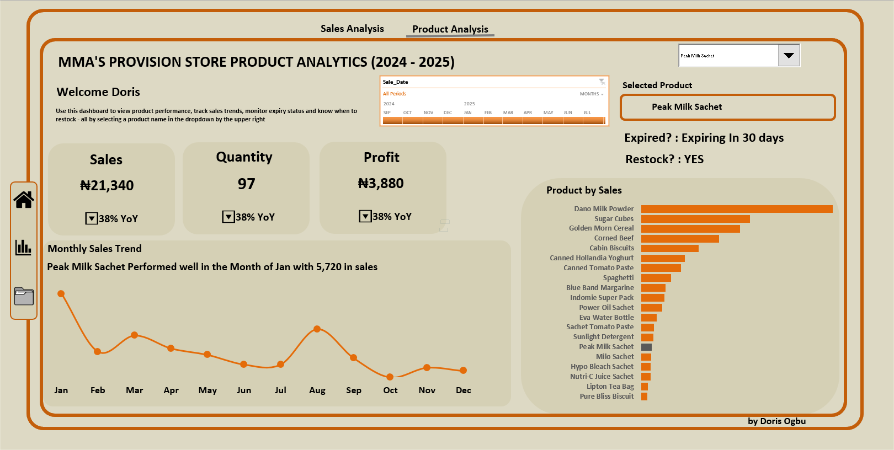
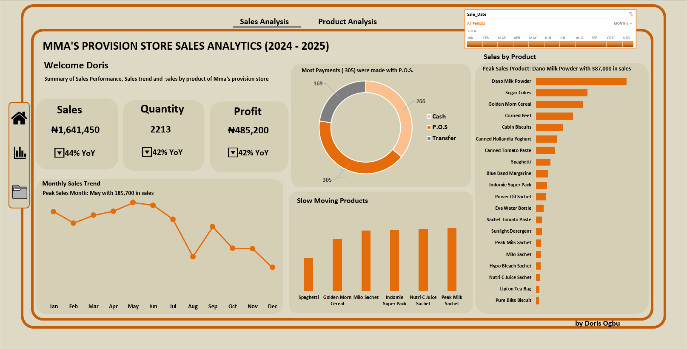

# MMA Provision Store Analytics Dashboard

# Project Overview
A comprehensive business intelligence solution for MMA Provision Store, a Nigerian FMCG retailer, providing real-time insights into sales performance, inventory management, and product analytics through interactive Excel dashboards.

# Business Problem
MMA Provision Store needed visibility into key business metrics to make data-driven decisions regarding:

- Revenue optimization and product performance
- Inventory management and restocking decisions
- Expiry management to minimize waste
- Year-over-year performance tracking

# Solution
I Built two interactive Excel dashboards leveraging Power Pivot and PivotCharts to provide:

- **Product Analysis Dashboard:** Deep-dive into individual product performance
- **Sales Analysis Dashboard:** High-level business metrics and trends

# Datasets Used
1. `Stock_Data.xlsx`

This dataset contains detailed information about products currently in stock.

| Column Name                    | Description                                                    |
|--------------------------------|----------------------------------------------------------------|
| Product_ID                     | Unique identifier for each product                             |
| Product_Name                   | Name of the product                                            |
| Category                       | Product category (e.g., Food, Beverage, Household)             |
| Cost_Price                     | Purchase price per unit                                        |
| Selling_Price                  | Selling price per unit                                         |
| Quantity_in_Stock              | Current quantity available in inventory                        |
| Stock_Status(Calculated)       | Threshold at which product should be restocked                 |
| Expiry_Status(Calculated)      | Expiry date of the product                                     |

2. `Sales_Data.xlsx`
This dataset contains transactional sales data between 2024 and 2025.

| Column Name      | Description                                                       |
|------------------|-------------------------------------------------------------------|
| Transaction_ID   | Unique ID for each sales transaction                              |
| Date             | Date the transaction occurred                                     |
| Product_ID       | Foreign key linked to the `Stock_Data` table                      |
| Product_Name     | Name of the product sold                                          |
| Quantity_Sold    | Number of units sold in the transaction                           |
| Unit_Price       | Selling price per unit (at time of sale)                          |
| Total_Sales      | Total revenue generated = Quantity_Sold × Unit_Price              |
| Profit           | Profit = (Unit_Price − Cost_Price) × Quantity_Sold                |

# Tools & Technologies

- Microsoft Excel 
- Power Pivot: Data modeling and relationships
- PivotCharts: Dynamic visualizations
- Excel Formulas: Calculated fields and KPIs
- Data Validation: Dropdown filters and controls

# Key Calculations
### Expiry_Status

`=IF([@[Expiry_Date]] < TODAY(), 0, IF([@[Expiry_Date]] <= TODAY() + 30, 2, 1))`

### Stock_status
`=IF([@[Quantity_in_Stock]]<=[@[Reorder_Level]],1,2)`

# Dashboard Features
## 1. Product Analysis Dashboard

This dashboard is designed for deep-dive analysis on a per-product basis. It features a dropdown filter that allows the user to select any product and instantly view its specific metrics. This includes:

### Product-Specific KPIs:

- Total Sales

- Quantity Sold

- Total Profit

- YoY Comparison: Specific to the selected product, allowing the user to compare its individual performance year-over-year.

- Inventory Health Checks:

  - **Restock Status:** A clear indicator (`YES` or `NO`) based on the Reorder_Level to prevent stockouts.

  - **Expiry Status:** A clear indicator (`YES`, `NO` Or `Expiring in 30 days`) that flags if a product is nearing its expiry date within a defined threshold (e.g., 30 days).
 
## 2. Sales Analysis Dashboard

This dashboard provides a holistic view of the store's performance from 2024 to 2025. It includes:

### Key Performance Indicators (KPIs):

- **Total Sales:** A real-time measure of gross revenue.

- **Quantity Sold:** The total number of units sold.

- **Total Profit:** The store's net profit.

- **Year-over-Year (YoY) Comparison:** Automated calculations for Sales, Quantity, and Profit, providing a quick way to gauge growth or decline. (Note: 2025 YoY trends may appear negative as the year is incomplete, and the dashboard will update automatically as new data is added.)

- **Payment Method Breakdown:** A donut chart visualizing the distribution of sales across different payment methods (e.g., Cash, POS, Transfer), highlighting the most popular method.

- **Best-Selling Products:** A bar chart identifying the top-performing products by total sales.

- **Slow-Moving Products:** A visual to help identify products with low sales volume, which may indicate a need for a promotional strategy or potential discontinuation.

- **Monthly Sales Trend:** A line chart showing sales trends over time, helping to identify seasonal patterns and peak sales periods.

### Usage Instructions

- Open Excel File: Load the `MMA_Store_Analytics.xlsx` file
- Enable Macros: Allow Excel to run calculations and updates
- Refresh Data: Use Data → Refresh All to update with latest information

*Built with ❤️ for small business growth through data-driven insights*

