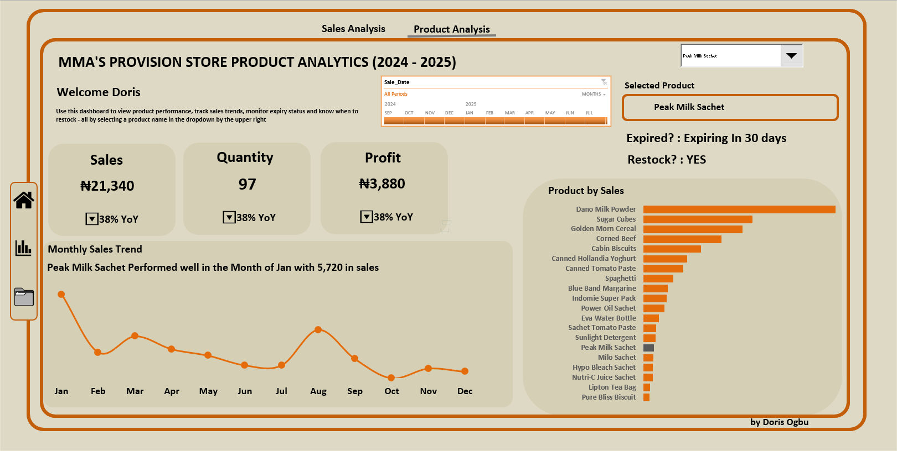
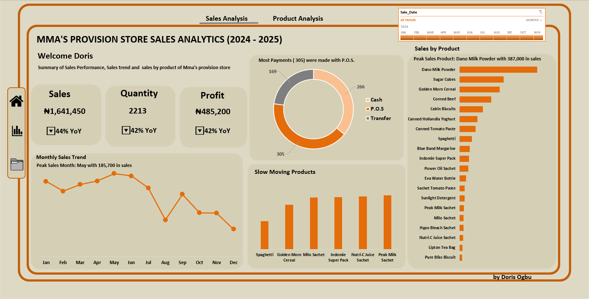

# MMA Provision Store Analytics Dashboard

# Project Overview
A comprehensive business intelligence solution for MMA Provision Store, a Nigerian FMCG retailer, providing real-time insights into sales performance, inventory management, and product analytics through interactive Excel dashboards.

# Business Problem
MMA Provision Store needed visibility into key business metrics to make data-driven decisions regarding:

- Revenue optimization and product performance
- Inventory management and restocking decisions
- Expiry management to minimize waste
- Year-over-year performance tracking

# Solution
I Built two interactive Excel dashboards leveraging Power Pivot and PivotCharts to provide:

- **Product Analysis Dashboard:** Deep-dive into individual product performance
- **Sales Analysis Dashboard:** High-level business metrics and trends

# Datasets Used
1. `Stock_Data.xlsx`

This dataset contains detailed information about products currently in stock.

| Column Name                    | Description                                                    |
|--------------------------------|----------------------------------------------------------------|
| Product_ID                     | Unique identifier for each product                             |
| Product_Name                   | Name of the product                                            |
| Category                       | Product category (e.g., Food, Beverage, Household)             |
| Cost_Price                     | Purchase price per unit                                        |
| Selling_Price                  | Selling price per unit                                         |
| Quantity_in_Stock              | Current quantity available in inventory                        |
| Stock_Status(Calculated)       | Threshold at which product should be restocked                 |
| Expiry_Status(Calculated)      | Expiry date of the product                                     |

2. `Sales_Data.xlsx`
This dataset contains transactional sales data between 2024 and 2025.

| Column Name      | Description                                                       |
|------------------|-------------------------------------------------------------------|
| Transaction_ID   | Unique ID for each sales transaction                              |
| Date             | Date the transaction occurred                                     |
| Product_ID       | Foreign key linked to the `Stock_Data` table                      |
| Product_Name     | Name of the product sold                                          |
| Quantity_Sold    | Number of units sold in the transaction                           |
| Unit_Price       | Selling price per unit (at time of sale)                          |
| Total_Sales      | Total revenue generated = Quantity_Sold × Unit_Price              |
| Profit           | Profit = (Unit_Price − Cost_Price) × Quantity_Sold                |

# Tools & Technologies

- Microsoft Excel 
- Power Pivot: Data modeling and relationships
- PivotCharts: Dynamic visualizations
- Excel Formulas: Calculated fields and KPIs
- Data Validation: Dropdown filters and controls

# Key Calculations
### Expiry_Status

`=IF([@[Expiry_Date]] < TODAY(), 0, IF([@[Expiry_Date]] <= TODAY() + 30, 2, 1))`

### Stock_status
`=IF([@[Quantity_in_Stock]]<=[@[Reorder_Level]],1,2)`

# Dashboard Features
## 1. Product Analysis Dashboard

This dashboard is designed for deep-dive analysis on a per-product basis. It features a dropdown filter that allows the user to select any product and instantly view its specific metrics. This includes:

### Product-Specific KPIs:

- Total Sales

- Quantity Sold

- Total Profit

- YoY Comparison: Specific to the selected product, allowing the user to compare its individual performance year-over-year.

- Inventory Health Checks:

  - **Restock Status:** A clear indicator (`YES` or `NO`) based on the Reorder_Level to prevent stockouts.

  - **Expiry Status:** A clear indicator (`YES`, `NO` Or `Expiring in 30 days`) that flags if a product is nearing its expiry date within a defined threshold (e.g., 30 days).
 
**Selected Product: Peak Milk Sachet** The dashboard is currently filtered on Peak Milk Sachet, showing **₦21,340 in sales, 97 units sold, and ₦3,880** in profit, all down **38% YoY.**

**Inventory Alerts** Peak Milk Sachet is flagged with two critical alerts  **Expiring in 30 days and Restock: YES.** This is a high-priority item that needs immediate attention to avoid both a stockout and potential expiry loss simultaneously.

**Monthly Sales Trend** The product performed best in **January with ₦5,720 in sales**, then declined sharply through mid-year before a recovery spike in August, followed by another drop. The inconsistency suggests unstable demand or irregular restocking patterns.

**Product by Sales** Ranking Across all products, Peak Milk Sachet ranks near the bottom of the sales chart, confirming its slow-moving status flagged in the Sales Dashboard. Dano Milk Powder, Sugar Cubes, and Golden Morn Cereal continue to dominate at the top.
 
## 2. Sales Analysis Dashboard

This dashboard provides a holistic view of the store's performance from 2024 to 2025. It includes:

### Key Performance Indicators (KPIs):

- **Total Sales:** A real-time measure of gross revenue.

- **Quantity Sold:** The total number of units sold.

- **Total Profit:** The store's net profit.

- **Year-over-Year (YoY) Comparison:** Automated calculations for Sales, Quantity, and Profit, providing a quick way to gauge growth or decline. (Note: 2025 YoY trends may appear negative as the year is incomplete, and the dashboard will update automatically as new data is added.)

- **Payment Method Breakdown:** A donut chart visualizing the distribution of sales across different payment methods (e.g., Cash, POS, Transfer), highlighting the most popular method.

- **Best-Selling Products:** A bar chart identifying the top-performing products by total sales.

- **Slow-Moving Products:** A visual to help identify products with low sales volume, which may indicate a need for a promotional strategy or potential discontinuation.

- **Monthly Sales Trend:** A line chart showing sales trends over time, helping to identify seasonal patterns and peak sales periods.

**Overall Performance** The store generated **₦1,641,450 in total sales with 2,213 units sold and ₦485,200 in profit**. All three metrics show a 44–42% YoY decline, which is expected given that 2025 data is still incomplete.

**Monthly Sales Trend** May was the peak sales month with **₦185,700 in sales**, followed by a notable dip in August and a continued downward trend toward December. This suggests possible seasonality or demand slowdown in the second half of the year.

**Payment Methods P.O.S**. is the most preferred payment method with **305 transactions, followed by Cash (266) and Transfer (169).** This points to a largely cashless customer base, which is worth factoring into operations.

**Best-Selling Products Dano Milk Powder** leads significantly with **₦387,000 in sales**, followed by Sugar Cubes and Golden Morn Cereal. These three products are clear revenue drivers and should always be prioritized for restocking.

**Slow-Moving Products Spaghetti, Golden Morn Cereal, Milo Sachet, Indomie Super Pack, Nutri-C Juice Sachet, and Peak Milk Sachet** are flagged as slow movers. Promotional strategies or pricing adjustments should be considered for these items to reduce stagnant inventory.

### Usage Instructions

- Open Excel File: Load the `MMA_Store_Analytics.xlsx` file
- Refresh Data: Use Data → Refresh All to update with latest information

Here is a simple recommendation and conclusion for the MMA Provision Store Analytics Dashboard:

**Recommendations**

Based on the dashboard insights, MMA Provision Store should take the following actions:

1.  **Immediate Inventory Intervention for Peak Milk Sachet:** This product requires urgent attention. With an "Expiring in 30 days" alert and a "Restock: YES" flag simultaneously, the store must prioritize selling the existing stock—potentially through discounting or bundling—before accepting new deliveries, to prevent both financial loss and overstock.

2.  **Protect Revenue from Top Performers:** Dano Milk Powder, Sugar Cubes, and Golden Morn Cereal are the core revenue drivers. Implement automated reorder triggers for these items to ensure they are *never* out of stock, as their absence would have an outsized negative impact on total sales.

3.  **Address Slow-Moving Products Strategically:** For items like Spaghetti, Milo Sachet, and Indomie Super Pack, launch targeted promotions such as "buy one, get one" offers or in-store displays. This will help convert stagnant inventory into cash and free up shelf space.

4.  **Optimize for Customer Payment Preferences:** Given the strong preference for P.O.S. and cashless payments, ensure P.O.S. machines are always functional, especially during peak hours and seasons, and consider offering small incentives for cash payments to balance transaction costs.

5.  **Refine Demand Forecasting:** The sales dip in the latter half of the year suggests a pattern. Use this insight to plan leaner inventory levels for that period in 2025, avoiding over-purchasing during predictable demand slowdowns.

## Conclusion

The MMA Provision Store Analytics Dashboard has successfully transformed raw sales and stock data into a clear, actionable business intelligence tool. It has pinpointed a critical, time-sensitive inventory risk with Peak Milk Sachet, identified the core products that drive the majority of revenue, and highlighted slow-moving items that are tying up capital. By acting on these insights specifically by resolving the Peak Milk conflict, safeguarding stock of top sellers, and strategically liquidating slow-moving inventory—MMA Provision Store can immediately reduce waste, improve cash flow, and strengthen its operational efficiency. This data-driven foundation positions the store not just to react to trends, but to proactively plan for a more profitable and resilient future.

*Built with ❤️ for small business growth through data-driven insights*

